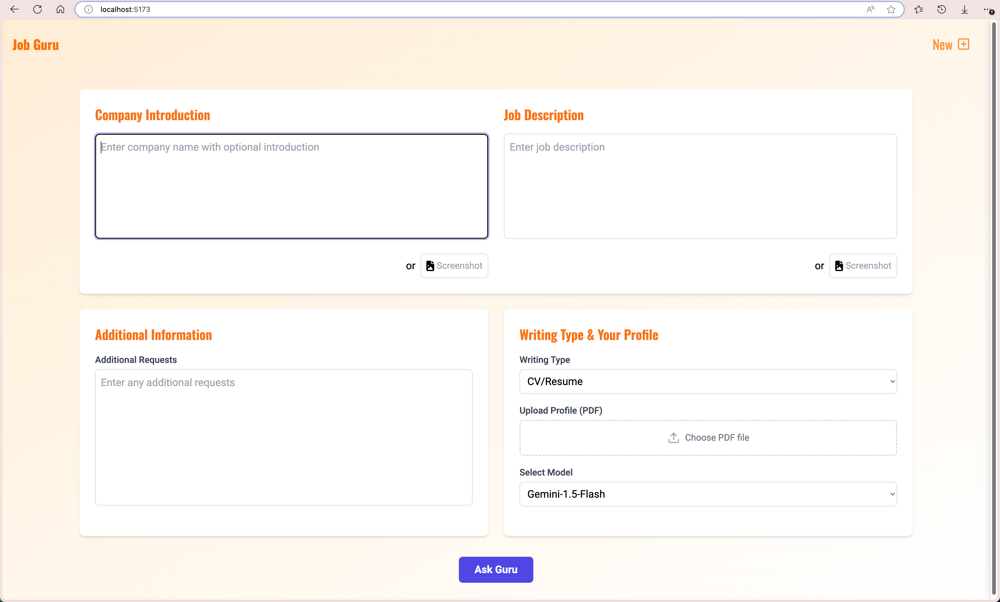
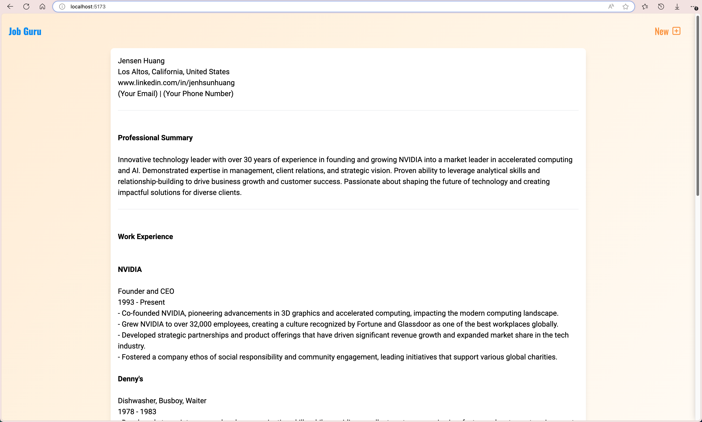

# Job Guru

Helps you write CV/Resume and Cover Letter with LLMs based on materials user provided such as personal profile, job descriptions, company, and other tailored user requests.

## What it looks like

---

## How to use

`cd py_backend`

`pip install -r requirements.txt`

`python server.py`

To run the backend Python Flask server.

---

`cd Job-Guru`

`npm install`

`npm run dev`

To run the frontend React app.